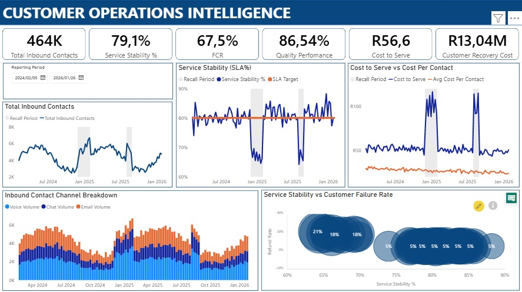
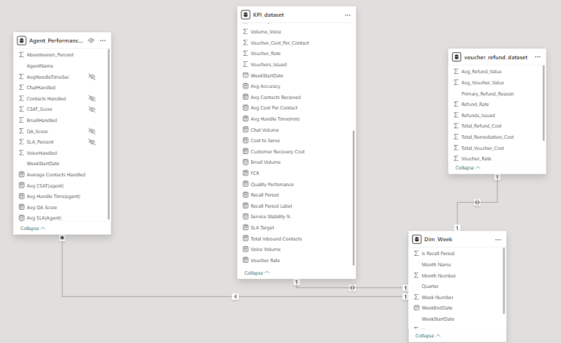

# Customer Operations Intelligence
### Executive Summary View — Part 1 of 3



---

## Overview

This dashboard series is built around a simulated customer operations environment for a national eCommerce business across 2 years, incorporating weekly contact centre performance, cost dynamics, and customer recovery behaviour.

The dataset spans normal operations alongside two recall periods, allowing for analysis of performance and stability under abnormal demand conditions.

---

## The Question This Dashboard Asks

Most dashboards answer:
> *"How did we perform?"*

This one asks:
> *"How stable is the operation under stress?"*

In high-demand periods — especially when things go wrong — these moments are often dismissed as "out of the norm." They are mentally filed away rather than analysed. Yet disruption windows frequently contain the most valuable operational insights.

They reveal how service stability behaves under genuine pressure, where cost structures begin to strain, and how customer friction accelerates when operational systems are tested beyond typical demand patterns.

Because the constraint is universal:
- Budgets are tight
- Reactive scaling is rarely sustainable
- Hiring more staff is not always viable

Understanding performance during abnormal demand events is less about explaining failure, and more about **identifying resilience gaps, efficiency thresholds, and structural pressure points** that remain hidden during stable periods.

---

## Dashboard — Part 1: Executive Summary View

The executive summary view is intentionally restrained. Its purpose is not deep-dive analytics, but an operational health check across five dimensions:

| Signal | Metric |
|---|---|
| Service Stability | SLA % vs target over time |
| Demand Variability | Total inbound contacts by week |
| Cost-to-Serve | Cost per contact trend |
| Channel Demand Mix | Voice / Chat / Email volume split |
| Customer Recovery | Voucher & refund rate signals |

**Key headline figures (full recall period):**

| KPI | Value |
|---|---|
| Total Inbound Contacts | 464K |
| Service Stability % | 79.1% |
| First Contact Resolution (FCR) | 67.5% |
| Quality Performance | 86.54% |
| Cost to Serve | R56.60 |
| Customer Recovery Cost | R13.04M |

---

## Series Roadmap

| Part | Focus | Status |
|---|---|---|
| Part 1 | Executive Summary — operational health check | ✅ Complete |
| Part 2 | Mechanics — workload pressure, efficiency behaviour, capacity dynamics | 🔄 In progress |
| Part 3 | TBC | 📋 Planned |

---

## Data Model

The report is built on three fact tables joined through a `Dim_Week` date dimension:



### Tables

**`call_center_kpi_dataset_fully_reconciled.csv`** — 104 rows (weekly KPI grain)

| Field | Description |
|---|---|
| WeekStartDate | Week commencing date |
| Volume_Received | Total inbound contacts received |
| SLA_Percent | % of contacts handled within SLA threshold |
| Quality_Score | QA evaluation score |
| Accuracy_Rate | Agent accuracy rate |
| FCR_Rate | First contact resolution rate |
| Avg_Handle_Time_Seconds | Average handle time per contact |
| Cost_Per_Contact | Operational cost per contact handled |
| Total_Operational_Cost | Total weekly operational cost |
| Refunds_Issued | Number of refunds issued |
| Vouchers_Issued | Number of vouchers issued |
| Total_Refund_Cost | Total cost of refunds |
| Total_Voucher_Cost | Total cost of vouchers |
| Refund_Rate | Refund issuance rate |
| Voucher_Rate | Voucher issuance rate |
| Total_Remediation_Cost | Combined refund + voucher cost |
| Total_Cost_Including_Remediation | Full cost including remediation |
| True_Cost_Per_Contact | Cost per contact including remediation |
| Refund_Cost_Per_Contact | Refund cost allocated per contact |
| Voucher_Cost_Per_Contact | Voucher cost allocated per contact |

---

**`agent_performance_enhanced_104_weeks.csv`** — 629 rows (agent × week grain)

| Field | Description |
|---|---|
| WeekStartDate | Week commencing date |
| AgentName | Agent identifier |
| CallsHandled | Total calls handled by agent |
| SLA_Percent | Agent-level SLA performance |
| AvgHandleTimeSec | Average handle time in seconds |
| QA_Score | Quality assurance score |
| CSAT_Score | Customer satisfaction score |
| Absenteeism_Percent | Absenteeism rate for the week |

---

**`voucher_refund_dataset_aligned_with_kpi_recall.csv`** — 312 rows (channel × reason × week grain)

| Field | Description |
|---|---|
| WeekStartDate | Week commencing date |
| Channel | Contact channel (Voice / Chat / Email) |
| Primary_Refund_Reason | Primary reason driving refund issuance |
| Vouchers_Issued | Vouchers issued by channel/reason |
| Refunds_Issued | Refunds issued by channel/reason |
| Avg_Voucher_Value | Average voucher value (R) |
| Avg_Refund_Value | Average refund value (R) |
| Total_Voucher_Cost | Total voucher cost |
| Total_Refund_Cost | Total refund cost |

---

## Dataset Note

All data in this project is **fully simulated**. It was purpose-built to reflect realistic contact centre dynamics including normal operating periods and two recall/disruption windows. No real customer, agent, or business data has been used.

---

## Tools Used

| Tool | Purpose |
|---|---|
| Power BI Desktop | Data modelling, DAX measures, dashboard design |
| Power Query | Data transformation and shaping |
| Microsoft Excel / CSV | Source data format |

---

## Files in This Repository

```
├── Customer_Operations_Intelligence.pbix   # Power BI report file
├── call_center_kpi_dataset_fully_reconciled.csv
├── agent_performance_enhanced_104_weeks.csv
├── voucher_refund_dataset_aligned_with_kpi_recall.csv
├── dashboard_screenshot.png
├── data_model_screenshot.png
└── README.md
```

---

## Author

**Jordan Nel** — Customer Relations & Insights Specialist | Power BI | SQL | Python  
[LinkedIn](https://www.linkedin.com/in/jordan-nel3) · [GitHub](https://github.com/hjnel3-droid)

